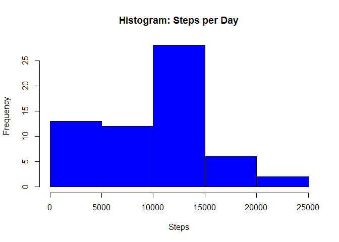
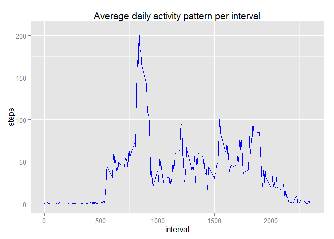
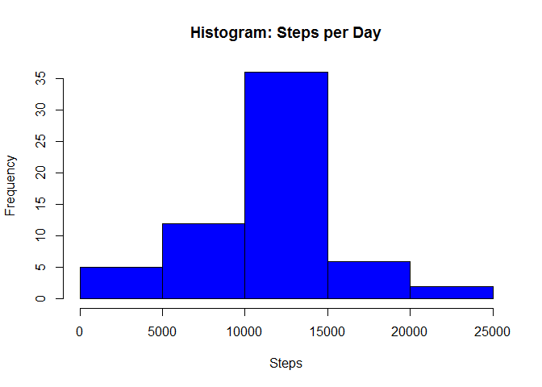
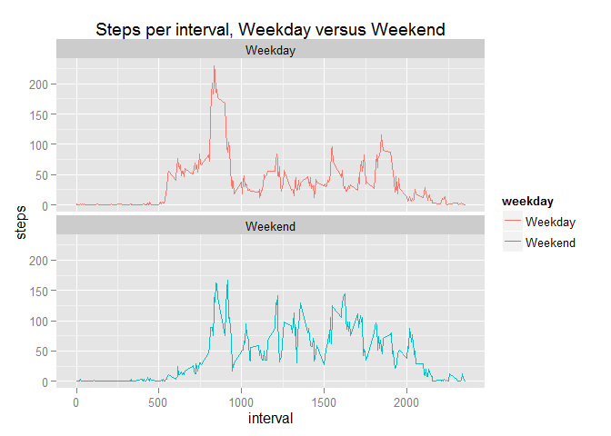

# Reproducible Reaseach: Assignment 1

Load libraries and data

```r
library(dplyr)
```

```
## 
## Attaching package: 'dplyr'
## 
## The following objects are masked from 'package:stats':
## 
##     filter, lag
## 
## The following objects are masked from 'package:base':
## 
##     intersect, setdiff, setequal, union
```

```r
library(ggplot2)
```

```
## Warning: package 'ggplot2' was built under R version 3.2.2
```

```r
amd <- read.csv("./activity.csv", header = TRUE)
summary(amd)
```

```
##      steps                date          interval     
##  Min.   :  0.00   2012-10-01:  288   Min.   :   0.0  
##  1st Qu.:  0.00   2012-10-02:  288   1st Qu.: 588.8  
##  Median :  0.00   2012-10-03:  288   Median :1177.5  
##  Mean   : 37.38   2012-10-04:  288   Mean   :1177.5  
##  3rd Qu.: 12.00   2012-10-05:  288   3rd Qu.:1766.2  
##  Max.   :806.00   2012-10-06:  288   Max.   :2355.0  
##  NA's   :2304     (Other)   :15840
```

Group by date, create histogram and calculate mean and median

```r
#spd = steps per day
spd <- group_by(amd, date) %>% summarize(stepsperday = sum(steps, na.rm=TRUE)) 
hist(spd$stepsperday, main="Histogram: Steps per Day", xlab = "Steps", ylab = "Frequency", col = "blue")
```

 

```r
cat("Mean of steps taken: ", mean(spd$stepsperday))
```

```
## Mean of steps taken:  9354.23
```

```r
cat("Median of steps taken: ", median(spd$stepsperday))
```

```
## Median of steps taken:  10395
```

Plot average daily activity pattern

```r
adap <- group_by(amd, interval) %>% summarize(steps = mean(steps, na.rm=TRUE)) 
ggplot(adap, aes(x=interval, y=steps)) +
  ggtitle("Average daily activity pattern per interval") +
  geom_line(color="blue")
```

 

```r
cat("Interval with maximum number of steps: ", adap$interval[which.max(adap$steps)])
```

```
## Interval with maximum number of steps:  835
```

Imputing missing values: use interval means to replace NAs, use adap from previous code that has interval averages

```r
cat("Number of intervals with missing steps from raw data: ", sum(is.na(amd$steps)))
```

```
## Number of intervals with missing steps from raw data:  2304
```

```r
#adap -> interval averages 
head(adap)
```

```
## Source: local data frame [6 x 2]
## 
##   interval     steps
## 1        0 1.7169811
## 2        5 0.3396226
## 3       10 0.1320755
## 4       15 0.1509434
## 5       20 0.0754717
## 6       25 2.0943396
```

```r
#find rows with NAs in steps
na_steps <- is.na(amd$steps)
#create copy of adap (interval averages) and change column name of steps to interval_avg to prepare for merge
interval_lookup <- adap
names(interval_lookup)[names(interval_lookup)=="steps"] <- "interval_avg"
#merge raw data with interval averages
amd_mean_na_merged <- merge(amd, interval_lookup, by="interval")
#order entries to match original file
amd_mean_na_merged <- amd_mean_na_merged[order(amd_mean_na_merged$date, amd_mean_na_merged$interval),]
#replace NA steps with interval averages for that interval
amd_mean_na_merged[na_steps,]$steps <- amd_mean_na_merged[na_steps,]$interval_avg
#check that all NAs have been replaced
cat("Number of intervals with missing steps data after replacement: ", sum(is.na(amd_mean_na_merged$steps)))
```

```
## Number of intervals with missing steps data after replacement:  0
```

Histogram of steps per day with Nas imputed

```r
spd_na <- group_by(amd_mean_na_merged, date) %>% summarize(stepsperday = sum(steps, na.rm=TRUE)) 
hist(spd_na$stepsperday, main="Histogram: Steps per Day", xlab = "Steps", ylab = "Frequency", col = "blue")
```

 

```r
cat("Mean of steps taken with NAs imputed: ", mean(spd_na$stepsperday))
```

```
## Mean of steps taken with NAs imputed:  10766.19
```

```r
cat("Median of steps taken with NAs imputed: ", median(spd_na$stepsperday))
```

```
## Median of steps taken with NAs imputed:  10766.19
```

```r
mean_delta <- mean(spd_na$stepsperday) - mean(spd$stepsperday)
median_delta <- median(spd_na$stepsperday) - median(spd$stepsperday)
cat("Mean difference - NAs replaced minus NAs dropped: ", mean_delta)
```

```
## Mean difference - NAs replaced minus NAs dropped:  1411.959
```

```r
cat("Median difference - NAs replaced minus NAs dropped: ", median_delta)
```

```
## Median difference - NAs replaced minus NAs dropped:  371.1887
```

Weekday versus Weekend

```r
#create new column (weekday) in raw data file indicating whether date is a weekday or weekend
#use ifelse to select based on day of the week, convert to factor
amd_mean_na_merged$weekday <- as.factor(ifelse(weekdays(as.Date(amd_mean_na_merged$date)) %in% c("Monday", "Tuesday", "Wednesday", "Thursday", "Friday"), "Weekday", "Weekend"))
head(amd_mean_na_merged)
```

```
##     interval     steps       date interval_avg weekday
## 1          0 1.7169811 2012-10-01    1.7169811 Weekday
## 63         5 0.3396226 2012-10-01    0.3396226 Weekday
## 128       10 0.1320755 2012-10-01    0.1320755 Weekday
## 205       15 0.1509434 2012-10-01    0.1509434 Weekday
## 264       20 0.0754717 2012-10-01    0.0754717 Weekday
## 327       25 2.0943396 2012-10-01    2.0943396 Weekday
```

```r
#group steps by interval and weekday
adap_week <- group_by(amd_mean_na_merged, interval, weekday) %>% summarize(steps = mean(steps))
#plot interval and steps with weekday shown in different color
ggplot(adap_week, aes(x=interval, y=steps, color=weekday)) +
  geom_line() +
  ggtitle("Steps per interval, Weekday versus Weekend") +
  facet_wrap(~weekday, ncol=1, nrow=2)
```

 

